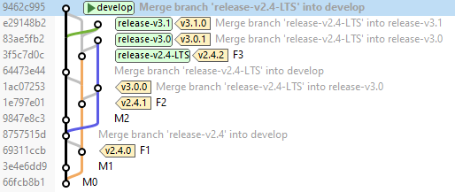

# Git Intensivo
## Sistemas de Controle de Versão (VCSs)

* Se várias pessoas trabalharem na mesma base de código, rapidamente se tornará impossível para elas trabalharem nos mesmos arquivos
* Cada desenvolvedor trabalha em isolamento sobre sua cópia local da base de código
  * Problema: Como podemos mergear essas cópias novamente quando terminamos?
  * Um **sistema de controle de versão (VCS)** torna esse processo muito mais fácil
    * Registra as modificações feitas em um conjunto de arquivos ao longo do tempo como **commits**
    * Possibilita a recuperação de versão específicas

### Branches

* Um **branch** é uma sequência particular de commits para a base de código
* O **head**, ou **ponta**, de um branch é o último commit nessa sequência

|  |
| :---------------------: |
|    **Branch e head**    |

* **Branchear** é criar um novo branch, dividindo o branch original em dois
* Branches se **mergeiam** quando os commits de uma branch são aplicadas a outra

|  |
| :----------------------: |
|   **Divisão e merge**    |

* Branchear é fácil
* Mergear é mais difícil
  * **Conflito textual** × **conflito semântico**
  * O trabalhos feitos isoladamente devem ser combinados em uma atualização de consenso
  * Não há como criar um algoritmo para chegar ao consenso automaticamente
  * Os humanos precisam chegar ao consenso
    * Pode envolver a mistura de partes escolhidas de diferentes atualizações
    * Frequentemente o consenso só pode ser atingido com atualizações originais para resolver conflitos

|                                         |
| :----------------------------------------------------------: |
| **[Falha apontada por LeRoy](https://twitter.com/jahnnie/status/937917022247120898) em como as pessoas desenham os diagramas de branches** |

### Evolução de Sistemas de Controle de Versão

#### Sistemas Locais de Controle de Versão

|                |
| :--------------------------: |
| **Controle de versão local** |

#### Sistemas Centralizados de Controle de Versão (CVCSs)

|                 |
| :---------------------------------: |
| **Controle de versão centralizado** |

#### Sistemas de Controle de Versão Distribuídos (DVCSs)

|                |
| :--------------------------------: |
| **Controle de versão distribuído** |

## Uma Breve História do Git

* Em 2002, o projeto do kernel do Linux começou a usar um DVCS proprietário chamado BitKeeper
* Em 2005, o detentor dos direitos autorais do BitKeeper retirou o uso gratuito do produto
* Linus Torvalds procurou um outro VCS, mas nenhum dos sistemas gratuitos disponíveis atendia às suas necessidades:
  * A aplicação de um patch no kernel de Linux não deve demorar mais do que três segundos
  * Considerar o [Concurrent Versions System](https://en.wikipedia.org/wiki/Concurrent_Versions_System) (CVS) como um exemplo do que não deve ser feito
  * Oferecer apoio para o desenvolvimento não linear (centenas de branches paralelos)
  * Oferecer apoio a um workflow distribuído semelhante ao [BitKeeper](https://en.wikipedia.org/wiki/BitKeeper)
  * Capacidade de lidar com projetos grandes como o kernel de Linux
  * Incluir proteções muito fortes contra a corrupção, seja acidental ou maliciosa
* Torvalds decidiu desenvolver seu próprio VCS:
  * O desenvolvimento começou em 3 de abril de 2005
  * Em 18 de abril, foi realizado o primeiro merge de múltiplos branches
  * Em 29 de abril, o Git registrou aplicações de patches ao kernel do Linux na taxa de 6.7 por segundo
  * Em 16 de junho, a entrega do kernel do Linux foi inteiramente gerenciada pelo Git
  * Em 11 de julho, foi entregue a versão 0.99.0
  * Em 16 de julho, Torvalds deixou o desenvolvimento a cargo de outro colaborador do projeto

## O Que É o Git

* Outros SVCs (CVS, Subversion) pensam nas informações que armazenam como um conjunto inicial de arquivos e as mudanças feitas em cada arquivo ao longo do tempo (isso é comumente descrito como controle de versão `delta-based`) 

|                                               |
| :----------------------------------------------------------: |
| **Armazenando dados como mudanças em versão base de cada arquivo** |

* Git pensa em seus dados mais como um **sequência de snapshots**

|                                            |
| :----------------------------------------------------------: |
| **Armazenando dados como snapshots do projeto ao longo do tempo** |

* No Git quase todas as operações são locais
* O Git armazena tudo em seu repositório local, não pelo nome do arquivo, mas pelo valor hash de seu conteúdo.

```
24b9da6552252987aa493b52f8696cd6d3b00373
```

* Git geralmente apenas adiciona dados ao seu repositório

### Os Três Estados

* **Modified**: O arquivo foi alterado, mas não foi cometido no repositório local
* **Staged**:  A versão atual do arquivo modificado foi marcada para entrar no próximo commit
* **Commited**: Os dados estão armazenados de forma segura no repositório local

|                                    |
| :----------------------------------------------: |
| **Diretório de trabalho, index, diretório .git** |

Workflow básico de Git:

1. Modifica arquivos no seu diretório de trabalho.
2. Adiciona as mudanças para a área de staging.
3. Faz um commit, que leva os arquivos como eles estão na staging area, armazena esses snapshots permanentemente para o diretório do Git.

## Workflows de Git

### Git-flow

Criado por [Vincent Driessen em 2010](https://nvie.com/posts/a-successful-git-branching-model/). 

|   |
| :--------------------: |
| **Modelo de Git-flow** |

#### Branch Principal

* Um branch único compartilhado (`origin/develop`) que atua como o estado atual do produto
* Git-flow é omisso sobre qual nível de saúde é requerido para o branch principal
* Uma alternativa para o branch principal é o trem de release

#### Integração por Feature

* Colocar todo trabalho para um feature no seu próprio branch
  * Abra uma branch separada para cada feature
  * Ramificar de `develop`
  * Pode ter qualquer nome descritivo (exemplo: new_oauth2_scopes)
  * Cometer nesse branch localmente
* Pode pushar essa branch regularmente para o repo do projeto
  * Outros membros do time podem ver no que está trabalhando
* Enquanto estiver trabalhando, outros features entrarão no `develop`
  * Pode mergear do `develop`
  * Resolver os conflitos com sua feature
* Integrar ao `develop` quando o **feature** estiver **concluído**
* Remova o branch do feature depois de integrado

|  |
| :--------------------------: |
|    **Branch de feature**     |

#### Branch de Release

* Branch que aceita apenas commits aceitos para estabilizar uma versão do produto pronta para o release
* Pode se ramificar do branch `develop`
* Convenção de nomenclatura `release-v<n>.<m>`

* Deve ser integrado de volta ao `develop`
* Deve ser removido quando o release não estiver mais em produção

|  |
| :---------------------: |
|  **Branch de release**  |

* Essencial para gerenciar múltiplas versões em produção

|                            |
| :-------------------------------------------------------: |
| **Branches de release com múltiplas versões em produção** |

#### Branch de Hotfix

* Branch para capturar trabalho para corrigir um defeito de produção urgente
* Trabalho de hotfix pode ser feito no branch de release
  * Essencialmente isso transforma o antigo branch de release em um branch de hotfix
  * Uma nova versão surge quando for concluído
* Deve ser integrado ao `develop`

|  |
| :--------------------: |
|  **Branch de hotfix**  |

#### Branch de Produção

* Um branch (`origin/master`) cujo `HEAD` marca a versão mais recente de produção da base de código

|  |
| :------------------------: |
|   **Branch de produção**   |

* Uma alternativa ao uso de branch de produção é aplicar um esquema de tagueamento

#### Vantagens de Git-flow

* Assegura uma configuração de branches limpa em qualquer momento do ciclo de vida do projeto
* O histórico de commits do repositório é um **registro detalhado do que realmente aconteceu**
* Os nomes dos branches seguem um padrão sistemático tornando mais fácil de compreender
* Pode acomodar várias versões em produção

#### Desvantagens de Git-flow

* O histórico de Git se torna ilegível, cheia de uma série confusa de commits de merge
* O branch de produção é desnecessário
* Desnecessariamente complicado: Um [grande script auxiliar](https://github.com/nvie/gitflow) foi desenvolvido para ajudar a cumprir o procedimento. Embora isso seja legal, não pode ser aplicado em uma GUI Git, apenas na linha de comando
* Integração por feature é incompatível com integração continua

### OneFlow

Proposta no artigo [Git-flow considered harmful por Adam Ruka em 2015](https://www.endoflineblog.com/gitflow-considered-harmful).

|  |
| :------------------------: |
|   **Modelo de OneFlow**    |

* OneFlow chama seu branch principal de `origin/master`
* O branch de produção é substituído por um esquema de tagueamento
* Os features são integrados no branch principal de forma a manter um histórico linear
* Os releases e hotfixes são feitos de forma semelhante ao Git-flow

#### Vantagens de Oneflow

* O histórico do Git será mais limpo, menos confuso, mais legível
  * O histórico de commits é a **história de como o projeto foi feito**
  * O branch é passada a limpo antes de ser mergeado no branch principal ([por que squash antes de merge](https://softwareengineering.stackexchange.com/questions/263164/why-squash-git-commits-for-pull-requests))
  * Conta a história da maneira que for melhor para leitores futuros

#### Desvantagens de Oneflow

* Usa de ferramentas avançadas como rebase interativo
* Integração por feature é incompatível com integração contínua

### GitHub Flow

Criado por [Scott Chacon em 2011](http://scottchacon.com/2011/08/31/github-flow.html).

#### Branch Principal Pronto para Release

* GitHub flow chama seu branch principal `origin/master`
* O branch de produção é substituído por um esquema de tagueamento
* O branch principal é mantido saldável para que o `HEAD` do branch principal sempre possa ser colocado diretamente em produção
* Os branches de release não são necessários: uma única versão em produção
* Os branches de hotfix não são necessários

#### Integração com o Branch Principal

* Os desenvolvedores integram seu trabalho fetchando o branch principal, mergeando e - se saudável - pushando de volta para o branch principal
* GitHub Flow recomenda alta frequência de integração, com período de integração variando entre 10 minutos a 2 semanas

##### Frequência de Integração

[Discussão de Martin Fowler](https://martinfowler.com/articles/branching-patterns.html#integration-frequency)

|            |
| :--------------------------------: |
| **Baixa frequência de integração** |

|              |
| :-------------------------------: |
| **Alta frequência de integração** |

|                       |
| :---------------------------------------------: |
| **Conflito com baixa frequência de integração** |

|                     |
| :--------------------------------------------: |
| **Conflito com alta frequência de integração** |

#### Integração Contínua

* Os desenvolvedores fazem a integração do branch principal assim que têm um commit saudável que podem compartilhar
* **Nunca deve ter mais do que um dia de trabalho não integrado em seu repositório local**
* Acostumar com a ideia de alcançar pontos de integração frequentes com **features parcialmente construídos**

|  |
| :-----------------------------: |
| **Delivery contínuo de GitHub** |

##### Integração por Feature × Integração Contínua

###### Integração por Feature

* Todo o código em um feature pode ser avaliado quanto à qualidade como uma unidade ✔
* O código do feature só é adicionado ao produto quando o feature estiver completo ✔
* Merges menos frequentes ❌

###### Integração Contínua

* Apoia integração em período menor do que o tamanho do feature ✔
* Tempo reduzido para encontrar conflitos ✔
* Merges menores ✔
* Encoraja a refatoração ✔
* Evidência científica de que contribui para um maior desempenho de entrega de software ✔
* Requer compromisso com branches saudáveis (e, portanto, código autotestável) ❌

#### Pull Request como Ferramenta de Conversação do Branch

* No GitHub flow, o **pull request** é usado mais como como uma ferramenta de conversação do branch do que propriamente uma solicitação de integração

|                  |
| :-------------------------------------: |
| **Início de discussão de pull request** |

|                       |
| :------------------------------------------: |
| **Continuação de discussão em pull request** |

|    |
| :-----------------------: |
| **Atualizando um branch** |

#### Revisão Pré-integração com Pull Request

* No GitHub flow, cada commit para o branch principal é revisado por pares, no pull-request, antes de o commit ser aceito
* Antes de submeter, a branch deve:
  * estar saldável
  * ser passada a limpo 
  * ter conflitos existentes com o branch principal resolvidos
* Difícil de ser usado com integração contínua

|        |
| :---------------------------: |
| **Aprovação de pull request** |

#### Vantagens de GitHub Flow

* Amigável à integração contínua
* Alternativa mais simples para Git-flow
* Ideal quando precisa manter uma versão única em produção

#### Desvantagens de GitHub Flow

* Requer compromisso com branches saudáveis
* Não recomendado quando várias versões em produção são necessárias

## Operações Básicas em Git

O [livro Pro Git](http://git-scm.com/book/pt-br/v2) inteiro, escrito por Scott Chacon, está disponível para leitura gratuita online.

### Clonando um Repositório Remoto

```bash
$ git clone https://github.com/susumuasaga/handson-oneflow.git
$ cd handson-oneflow
```

### Criando um Branch de Feature

```bash
$ git checkout -b meu_recurso develop
```

### Atualizando Commits de Repositórios Remotos

```bash
$ git fetch origin
```
### Atualizando um Branch com Merge (modo Git-flow)

```bash
$ git checkout meu_recurso
$ git merge develop
```

|                |
| :---------------------------------: |
| **Atualizando um branch com merge** |

### Atualizando um Branch com Rebase (modo OneFlow)

```bash
$ git checkout meu_recurso
$ git rebase develop
```

|  |
| :----------------------------------: |
| **Atualizando um branch com rebase** |

### Integrando um Branch de Feature ao `develop` (modo Git-flow)

```bash
$ git checkout develop
$ git merge --no-ff meu_recurso
```
|      |
| :------------------------------: |
| **Merge com e sem fast-forward** |

### Integrando um Branch de Feature ao `develop` (modo OneFlow)

```bash
$ git checkout meu_recurso
$ git rebase --interactive develop
$ git checkout develop
$ git merge --ff-only meu_recurso
```

|              |
| :----------------------------------------------: |
| **Integrando feature com rebase, squash, merge** |

### Apagando uma Branch

```bash
$ git branch --delete meu_recurso
```

### Subindo um Branch para o Repositório Remoto

```bash
$ git push origin develop
```
